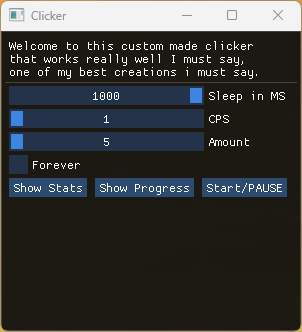

# EpicClicker
So yeah i made myself an autoclicker...
Why?
Because i felt like it.
Here's a Screenshot:

---
I guess if you have any knowledge in c++ stuff than you know how to build it.  
But maybe you don't so here's how:

1. clone the repo:  
`git clone --recursive https://github.com/CHoneyfox/EpicClicker.git`  
2. you hop into your newly acquired directory:  
`cd EpicClicker`
3. you should probably make a new folder for the build stuff so you have a nice folder structure:  
`mkdir build`
and
`cd build`
4. now you use cmake to build the executable (assuming you have cmake installed, if not go get it, there ya go: [cmake](https://cmake.org)):  
`cmake ..`  
plus  
`cmake --build .`  
5. yeah that's it  
---
Ah yeah and i should probably mention that i only tried building it with the compiler from microsoft so if you want to use MinGW you'll probably also need to download [this](https://github.com/meganz/mingw-std-threads.git) because mingw doesn't really like the std::threads from the normal STL.

Which reminds me... 
It only works on Windows, sadly i had to use the Windows API for the clicking stuff.
Maybe there'll be an update in the future for linux support idk yet.
Anyway that's it, cya and have fun!